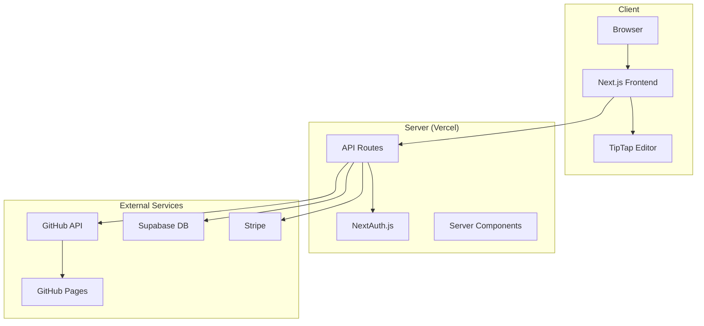

# StaticPress

**The simple, elegant editor for static site blogs**

[](https://nextjs.org/)
[](https://www.typescriptlang.org/)
[](LICENSE)

StaticPress is a web-based WYSIWYG editor that makes writing and publishing to static site blogs (Hugo and Krems) as simple as using WordPress. Connect your GitHub repository, write in a beautiful interface, and let StaticPress handle all the complexity of file structures, Git commits, and deployments.

## 🌟 Features

### Core Writing Experience
- **Premium Editor** - Notion-style writing with Slash commands, Bubble menu, and Focus mode
- **One-Click Publishing** - Click publish and your post appears on your blog in seconds
- **Automatic Git Management** - No need to know Git; we handle all commits automatically
- **Smart File Organization** - Follows Hugo/Krems conventions without you thinking about it

### Multi-Engine Support
- **Hugo** - Full support for the world's fastest static site generator
- **Krems** - Our simplified engine for users who want even less complexity

### Professional Features
- **Image Uploads** - Drag-and-drop images directly into your posts (Personal tier+)
- **Theme Gallery** - Choose from 6 curated Hugo themes
- **GitHub Pages Deployment** - One-click deployment with custom domain support
- **Draft Management** - Save drafts and publish when ready

### Subscription Tiers
- **Free** - Text-only blogging, edit last 5 posts
- **Personal ($2.50/mo)** - Unlimited posts, image uploads
- **SMB ($5/mo)** - Theme gallery, custom domains (coming soon)
- **Pro ($10/mo)** - Manage up to 5 blogs (coming soon)

## 🏗 Architecture Overview



## 🚀 Getting Started

### Prerequisites

- Node.js 18+ and npm
- GitHub account for OAuth
- Supabase account for database
- Stripe account for payments (optional for development)

### Environment Variables

Create a `.env.local` file in the root directory:

```bash
# NextAuth
AUTH_SECRET=your-random-secret-here
NEXTAUTH_URL=http://localhost:3000

# GitHub OAuth App
AUTH_GITHUB_ID=your-github-oauth-id
AUTH_GITHUB_SECRET=your-github-oauth-secret

# Supabase
NEXT_PUBLIC_SUPABASE_URL=https://your-project.supabase.co
SUPABASE_SERVICE_ROLE_KEY=your-service-role-key

# Stripe (optional for local development)
STRIPE_SECRET_KEY=sk_test_...
NEXT_PUBLIC_STRIPE_PUBLISHABLE_KEY=pk_test_...
STRIPE_WEBHOOK_SECRET=whsec_...

# Stripe Price IDs (create in Stripe Dashboard)
STRIPE_PERSONAL_MONTHLY_PRICE_ID=price_...
STRIPE_PERSONAL_YEARLY_PRICE_ID=price_...
STRIPE_SMB_MONTHLY_PRICE_ID=price_...
STRIPE_SMB_YEARLY_PRICE_ID=price_...
STRIPE_PRO_MONTHLY_PRICE_ID=price_...
STRIPE_PRO_YEARLY_PRICE_ID=price_...
```

### Database Setup

1. Create a Supabase project
2. Run the SQL migrations in order:
   - `/scripts/init-db.sql` - Base schema
   - `/supabase/migrations/*.sql` - Additional tables and updates

### Local Development

```bash
# Install dependencies
npm install

# Run development server
npm run dev

# Open http://localhost:3000
```

### Testing Stripe Webhooks Locally

```bash
# Install Stripe CLI
brew install stripe/stripe-cli/stripe

# Forward webhooks to local server
stripe listen --forward-to localhost:3000/api/stripe/webhook

# Use the webhook signing secret shown in the output
```

## 📁 Project Structure

```
staticpress/
├── app/                    # Next.js 15 App Router
│   ├── api/               # API routes
│   │   ├── auth/          # NextAuth.js endpoints
│   │   ├── posts/         # Post CRUD operations
│   │   ├── repos/         # Repository management
│   │   ├── stripe/        # Payment endpoints
│   │   ├── deploy/        # Deployment automation
│   │   └── images/        # Image upload handling
│   ├── dashboard/         # Main editor interface
│   ├── setup/            # Repository selection/creation
│   ├── onboarding/       # User onboarding wizard
│   ├── pricing/          # Subscription tiers
│   └── settings/         # User and repo settings
├── components/            # React components
│   ├── dashboard-client.tsx  # Main dashboard UI
│   ├── editor.tsx           # TipTap WYSIWYG editor
│   ├── file-browser.tsx     # Post list/browser
│   └── upgrade-modal.tsx    # Paywall for free tier
├── lib/                   # Core utilities
│   ├── auth.ts           # NextAuth configuration
│   ├── db.ts             # Database functions (lazy init)
│   ├── github.ts         # GitHub API client
│   ├── hugo.ts           # Hugo/Krems path utilities
│   ├── stripe.ts         # Stripe client (lazy init)
│   ├── themes.ts         # Theme definitions
│   ├── cookies.ts        # Repository config
│   └── cache.ts          # API response caching
└── scripts/              # Database migrations
```

## 🔑 Key Concepts

### Lazy Initialization Pattern

To prevent build-time errors on Vercel, database and Stripe clients must be lazily initialized:

```typescript
// ❌ WRONG - Will fail at build time
const supabase = createClient(url, key)

// ✅ CORRECT - Lazy initialization
let _supabase: SupabaseClient | null = null
async function getSupabase() {
  if (!_supabase) {
    const { createClient } = await import('@supabase/supabase-js')
    _supabase = createClient(url, key)
  }
  return _supabase
}
```

### Engine Support

StaticPress supports two static site generators:

#### Hugo (Traditional)
- File structure: `content/posts/YYYY/MM/slug.md`
- Full frontmatter support (title, date, draft, tags, categories)
- Theme gallery with 6 options
- 4-step onboarding process

#### Krems (Simplified)
- File structure: `slug.md` (root directory)
- Minimal frontmatter (title, date only)
- Auto-deployment to GitHub Pages
- 2-step onboarding process

### Theme Management

Themes are managed as Git submodules for Hugo blogs:

```typescript
// Adding a theme creates a submodule at themes/[theme-id]
await github.addThemeSubmodule(owner, repo, theme.repo, theme.id)
```

### Deployment Flow

1. User creates/connects repository
2. Optional: Enable GitHub Pages with one click
3. Optional: Configure custom domain
4. StaticPress triggers workflow dispatch for builds

## 🔌 API Reference

### Authentication
- `GET /api/auth/[...nextauth]` - NextAuth.js OAuth flow

### Posts
- `GET /api/posts` - List all posts (cached 5 minutes)
- `POST /api/posts/publish` - Create or update a post
- `DELETE /api/posts/delete` - Delete a post

### Repositories
- `POST /api/repos/create` - Create blog from template
- `POST /api/repos/connect` - Connect existing repository
- `POST /api/repos/theme` - Change blog theme
- `POST /api/repos/site-url` - Update site URL

### Deployment
- `POST /api/deploy/github-pages` - Enable GitHub Pages

### Images
- `POST /api/images/upload` - Upload image to repository

### Payments
- `POST /api/stripe/create-checkout-session` - Start subscription
- `POST /api/stripe/create-portal-session` - Manage subscription
- `POST /api/stripe/webhook` - Process Stripe events

## 💾 Database Schema

### Core Tables

#### users
- Stores GitHub user information
- Tracks subscription tier and status
- Links to Stripe customer/subscription IDs

#### repositories
- User's connected repositories
- Stores engine type (hugo/krems)
- Theme selection and site URL
- Content path configuration

#### usage_tracking
- Tracks post edit counts for free tier limits
- Resets monthly

#### analytics_events
- Server-side event tracking
- No PII, just event names and metadata

## 🚢 Deployment

### Vercel Deployment

1. Fork this repository
2. Connect to Vercel
3. Add environment variables in Vercel dashboard
4. Deploy

### Required Environment Variables

All variables from `.env.local` must be added to Vercel:
- Authentication secrets
- GitHub OAuth credentials
- Supabase connection details
- Stripe API keys and price IDs

### Post-Deployment Setup

1. Update GitHub OAuth callback URL: `https://your-app.vercel.app/api/auth/callback/github`
2. Configure Stripe webhook endpoint: `https://your-app.vercel.app/api/stripe/webhook`
3. Enable Supabase Row Level Security (RLS)

## 🤝 Contributing

We welcome contributions! Please see our [Contributing Guide](CONTRIBUTING.md) for details.

### Development Workflow

1. Fork the repository
2. Create a feature branch
3. Make your changes
4. Test locally with `npm run dev`
5. Submit a pull request

### Code Style

- TypeScript for type safety
- Prettier for formatting
- ESLint for linting
- Conventional commits

## 🐛 Troubleshooting

### Common Issues

#### "Missing Supabase configuration" error
- Ensure environment variables are set correctly
- Check that Supabase project is active

#### GitHub API rate limits
- Posts are cached for 5 minutes
- Consider implementing user-specific caching

#### Stripe webhook failures
- Verify webhook signing secret matches
- Check that webhook endpoint is accessible

#### Build failures on Vercel
- Ensure lazy initialization pattern is used
- Check for module-level database/Stripe client creation

### Debug Mode

Enable debug logging by setting:
```bash
DEBUG=staticpress:*
```

## 📄 License

MIT License - see [LICENSE](LICENSE) file for details.

## 🙏 Acknowledgments

- [Next.js](https://nextjs.org/) - The React framework
- [TipTap](https://tiptap.dev/) - Extensible rich-text editor
- [Tailwind CSS](https://tailwindcss.com/) - Utility-first CSS
- [Supabase](https://supabase.com/) - Open source Firebase alternative
- [Stripe](https://stripe.com/) - Payment processing
- [Hugo](https://gohugo.io/) - The world's fastest static site generator

## 📞 Support

- Documentation: [docs.staticpress.me](https://docs.staticpress.me) (coming soon)
- GitHub Issues: [Report a bug](https://github.com/yourusername/staticpress/issues)
- Email: support@staticpress.me (coming soon)

---

Built with ❤️ for writers who want simplicity without sacrificing control.
